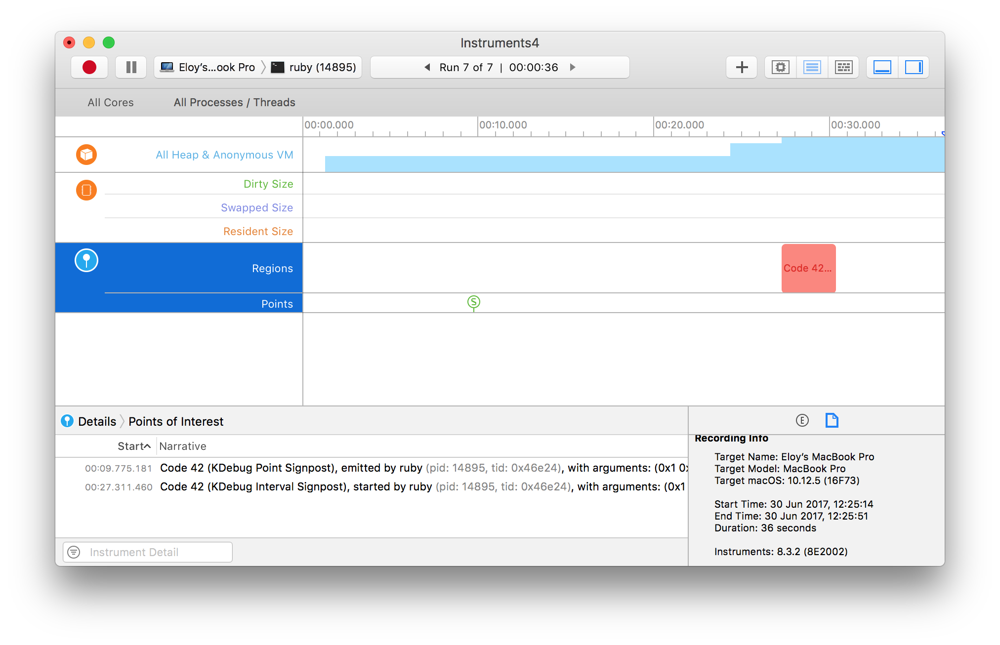
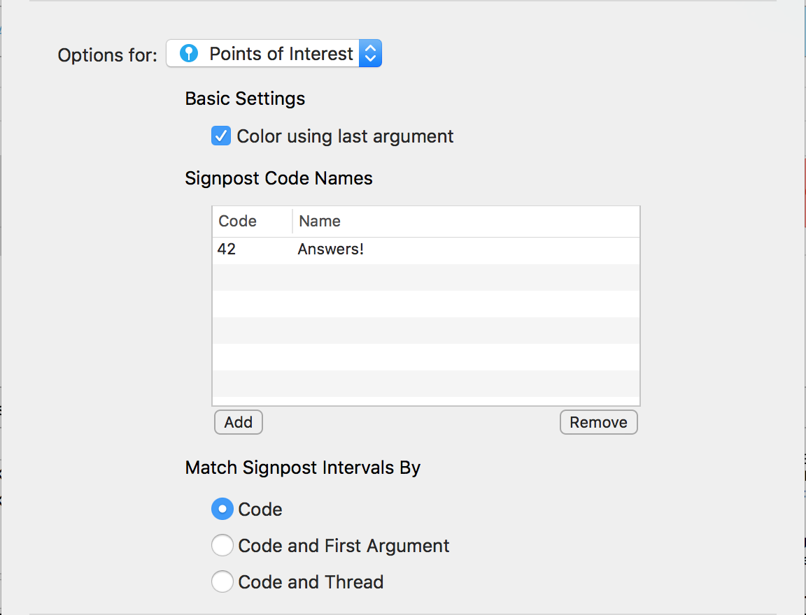

# Instruments

A small Ruby C extension that allows you to send signals to Instruments.app to indicate interesting points or regions.

For more info about Instruments and the ‘Points of Interest’ instrument, see
[these slides](http://devstreaming.apple.com/videos/wwdc/2016/411jge60tmuuh7dolja/411/411_system_trace_in_depth.pdf).

Note that this uses the `kdebug_signpost` API, which is only available since macOS 10.12.

## Example

Consider the following process:

```ruby
require "instruments"

p Process.pid # => 14895

# A single event
Instruments.signpost(42, 1, 2, 3, Instruments::COLORS[:light_green])

# A region
Instruments.signpost(42, 1, 2, 3, Instruments::COLORS[:light_red]) do
  sleep 3
end
```

When attaching Instruments.app using the ‘Points of Interest’ instrument you’d get the following:



Note that the color coding only works when the instrument is configured to do so (File -> Recording Options…):


